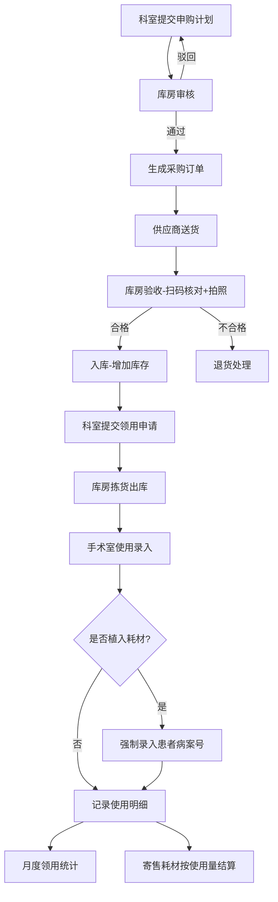

## 1. 产品概述

医院高值耗材全流程管理平台——覆盖从科室申购、库房审核采购、供应商送货验收、科室领用、手术室使用到财务结算的全生命周期闭环管理，确保高值耗材可追溯、可管控、可结算。
- 目标用户：医院科室医生/护士、库房管理员、采购人员、财务人员、供应商
- 核心价值：杜绝耗材流失、效期预警、植入耗材患者追溯、寄售耗材按量结算

## 2. 核心功能

### 2.1 用户角色

| 角色 | 注册方式 | 核心权限 |
|------|----------|----------|
| 科室人员 | 管理员分配账号 | 提交申购计划、提交领用申请、录入使用明细 |
| 库房管理员 | 管理员分配账号 | 审核申购、验收入库、拣货出库、库存管理 |
| 采购人员 | 管理员分配账号 | 生成采购订单、跟踪供应商送货 |
| 财务人员 | 管理员分配账号 | 查看领用明细、生成结算单、对账 |
| 系统管理员 | 系统初始化 | 用户管理、基础数据维护、系统配置 |

### 2.2 功能模块

1. **首页仪表盘**：全院高值耗材库存金额、近效期占比、各科室领用排行、待办事项提醒
2. **申购管理**：科室提交申购计划、库房审核、生成采购订单
3. **入库验收**：供应商送货登记、随货同行单管理、扫码核对（品名/规格/批号/效期/数量）、拍照上传、验收入库
4. **领用管理**：科室领用申请、库房拣货出库确认
5. **使用管理**：手术室术后录入使用明细、植入耗材强制关联患者病案号
6. **结算管理**：月度科室领用统计、供应商寄售耗材按实际使用量生成结算单
7. **基础数据**：科室管理、供应商管理、耗材目录、字典维护

### 2.3 页面详情

| 页面名称 | 模块名称 | 功能描述 |
|----------|----------|----------|
| 首页仪表盘 | 库存概览 | 展示全院高值耗材库存总金额、近效期耗材占比、效期预警列表 |
| 首页仪表盘 | 领用排行 | 各科室领用金额/数量排行榜 |
| 首页仪表盘 | 待办提醒 | 待审核申购、待验收订单、待出库领用等待办事项 |
| 申购管理 | 申购列表 | 科室查看本部门申购记录及状态，库房查看全院申购 |
| 申购管理 | 新建申购 | 选择耗材目录、填写数量、提交申购计划 |
| 申购管理 | 申购审核 | 库房逐条或批量审核申购计划，审核通过后生成采购订单 |
| 入库验收 | 送货登记 | 登记供应商送货信息、上传随货同行单 |
| 入库验收 | 验收操作 | 扫码核对品名/规格/批号/效期/数量、拍照上传实物照片、确认验收 |
| 入库验收 | 入库记录 | 查看历史入库记录 |
| 领用管理 | 领用申请 | 科室选择耗材、填写领用数量、提交申请 |
| 领用管理 | 出库确认 | 库房确认拣货、扣减库存、确认出库 |
| 领用管理 | 领用记录 | 查看历史领用记录 |
| 使用管理 | 使用录入 | 术后录入实际使用明细，植入耗材强制输入患者病案号 |
| 使用管理 | 使用记录 | 查看历史使用记录，支持按患者追溯 |
| 结算管理 | 科室领用统计 | 按月汇总各科室领用明细和金额 |
| 结算管理 | 供应商结算 | 寄售耗材按实际使用量生成结算单，支持对账确认 |
| 基础数据 | 科室管理 | 维护科室信息（心内科/骨科/眼科等） |
| 基础数据 | 供应商管理 | 维护供应商信息及寄售关系 |
| 基础数据 | 耗材目录 | 维护高值耗材品名、规格、型号、单价、是否植入类等 |

## 3. 核心流程

### 3.1 申购-采购流程
科室提交申购计划 → 库房审核 → 审核通过生成采购订单 → 供应商确认订单 → 送货

### 3.2 验收入库流程
供应商送货（附随货同行单）→ 库房扫码核对品名/规格/批号/效期/数量 → 拍照上传实物照片 → 验收合格入库（增加库存）

### 3.3 领用出库流程
科室提交领用申请 → 库房确认拣货 → 扣减库存出库

### 3.4 手术使用流程
术后录入使用明细 → 植入耗材强制录入患者病案号 → 使用记录关联患者

### 3.5 财务结算流程
每月统计各科室领用明细 → 供应商寄售耗材按实际使用量生成结算单 → 财务确认对账

## 4. 用户界面设计

### 4.1 设计风格
- 主色调：深蓝（#1B3A5C）+ 翡翠绿（#10B981）作为强调色，体现医疗专业感
- 辅助色：浅灰背景（#F8FAFC）、白色卡片、琥珀色预警（#F59E0B）
- 按钮风格：圆角6px，主操作按钮深蓝实心，次要操作浅蓝描边
- 字体：思源黑体/Noto Sans SC，标题18-24px，正文14px，辅助12px
- 布局风格：左侧导航栏 + 顶部面包屑 + 主内容区卡片式布局
- 图标风格：线性图标（Lucide），2px描边

### 4.2 页面设计概览

| 页面名称 | 模块名称 | UI要素 |
|----------|----------|--------|
| 首页仪表盘 | 库存概览 | 大数字卡片（库存金额、近效期占比）、环形进度图 |
| 首页仪表盘 | 领用排行 | 横向柱状图，科室名称+金额 |
| 首页仪表盘 | 待办提醒 | 列表卡片，状态标签颜色区分紧急程度 |
| 申购管理 | 申购列表 | 表格+筛选+状态标签，支持分页 |
| 申购管理 | 新建申购 | 抽屉式表单，耗材搜索选择器 |
| 入库验收 | 验收操作 | 分步表单，扫码区+信息核对区+拍照上传区 |
| 领用管理 | 领用申请 | 卡片式耗材选择+数量输入 |
| 使用管理 | 使用录入 | 表格录入，植入耗材行高亮+病案号必填标识 |
| 结算管理 | 结算单 | 表格+汇总统计条+导出按钮 |

### 4.3 响应式设计
- 桌面优先设计，主要面向1920×1080分辨率
- 平板端（1024px+）自适应侧边栏折叠
- 移动端暂不作为主要适配目标

## 4.4 3D场景指导
- 不适用
