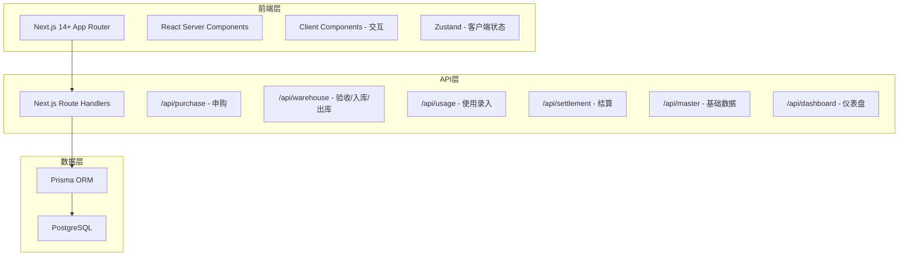
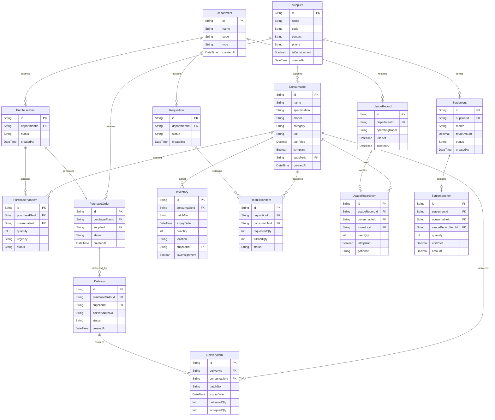

## 1. 架构设计



## 2. 技术说明

- 前端：Next.js 14+ (App Router) + React 18 + TailwindCSS 3 + Zustand
- 初始化工具：create-next-app
- API：Next.js Route Handlers (API Routes)
- 数据库：PostgreSQL + Prisma ORM
- 图表：Recharts
- 图标：lucide-react
- 样式：TailwindCSS + 自定义CSS变量

## 3. 路由定义

| 路由 | 用途 |
|------|------|
| / | 首页仪表盘 |
| /purchase | 申购管理列表 |
| /purchase/new | 新建申购 |
| /purchase/[id] | 申购详情 |
| /acceptance | 入库验收列表 |
| /acceptance/[id] | 验收操作页 |
| /requisition | 领用管理列表 |
| /requisition/new | 新建领用 |
| /usage | 使用管理列表 |
| /usage/new | 新增使用录入 |
| /settlement | 结算管理 |
| /master/departments | 科室管理 |
| /master/suppliers | 供应商管理 |
| /master/consumables | 耗材目录 |

## 4. API定义

### 4.1 申购模块
```typescript
// POST /api/purchase - 创建申购计划
interface CreatePurchasePlanRequest {
  departmentId: string;
  items: { consumableId: string; quantity: number; urgency: 'routine' | 'urgent' }[];
}

// GET /api/purchase - 获取申购列表
interface PurchasePlanListResponse {
  items: PurchasePlan[];
  total: number;
}

// PUT /api/purchase/[id]/review - 审核申购
interface ReviewPurchaseRequest {
  action: 'approve' | 'reject';
  reviewItems: { itemId: string; approved: boolean; remark?: string }[];
}
```

### 4.2 验收入库模块
```typescript
// POST /api/warehouse/delivery - 登记送货
interface RegisterDeliveryRequest {
  purchaseOrderId: string;
  supplierId: string;
  deliveryNoteNo: string;
  items: { consumableId: string; batchNo: string; expiryDate: string; quantity: number }[];
}

// PUT /api/warehouse/acceptance/[id] - 验收入库
interface AcceptDeliveryRequest {
  deliveryId: string;
  items: { itemId: string; acceptedQty: number; photos: string[]; remark?: string }[];
}
```

### 4.3 领用模块
```typescript
// POST /api/requisition - 创建领用申请
interface CreateRequisitionRequest {
  departmentId: string;
  items: { consumableId: string; quantity: number }[];
}

// PUT /api/requisition/[id]/fulfill - 出库确认
interface FulfillRequisitionRequest {
  items: { itemId: string; fulfilledQty: number; batchNo: string }[];
}
```

### 4.4 使用模块
```typescript
// POST /api/usage - 录入使用明细
interface CreateUsageRequest {
  departmentId: string;
  operatingRoom: string;
  items: {
    requisitionItemId: string;
    consumableId: string;
    usedQty: number;
    isImplant: boolean;
    patientId?: string;
  }[];
}
```

### 4.5 结算模块
```typescript
// GET /api/settlement/department - 科室领用统计
interface DepartmentSettlementQuery {
  month: string; // YYYY-MM
  departmentId?: string;
}

// POST /api/settlement/supplier - 生成供应商结算单
interface CreateSupplierSettlementRequest {
  supplierId: string;
  month: string;
}
```

### 4.6 仪表盘
```typescript
// GET /api/dashboard - 仪表盘数据
interface DashboardResponse {
  totalInventoryValue: number;
  nearExpiryRatio: number;
  nearExpiryItems: { name: string; expiryDate: string; daysLeft: number }[];
  departmentRanking: { departmentName: string; amount: number }[];
  pendingTasks: { type: string; count: number; label: string }[];
}
```

## 5. 数据模型

### 6.1 数据模型定义



### 6.2 数据定义语言

```sql
CREATE TABLE "Department" (
  "id" TEXT PRIMARY KEY DEFAULT gen_random_uuid(),
  "name" TEXT NOT NULL,
  "code" TEXT NOT NULL UNIQUE,
  "type" TEXT NOT NULL DEFAULT 'clinical',
  "createdAt" TIMESTAMP NOT NULL DEFAULT NOW()
);

CREATE TABLE "Supplier" (
  "id" TEXT PRIMARY KEY DEFAULT gen_random_uuid(),
  "name" TEXT NOT NULL,
  "code" TEXT NOT NULL UNIQUE,
  "contact" TEXT,
  "phone" TEXT,
  "isConsignment" BOOLEAN NOT NULL DEFAULT false,
  "createdAt" TIMESTAMP NOT NULL DEFAULT NOW()
);

CREATE TABLE "Consumable" (
  "id" TEXT PRIMARY KEY DEFAULT gen_random_uuid(),
  "name" TEXT NOT NULL,
  "specification" TEXT NOT NULL,
  "model" TEXT,
  "category" TEXT NOT NULL,
  "unit" TEXT NOT NULL,
  "unitPrice" DECIMAL(12,2) NOT NULL,
  "isImplant" BOOLEAN NOT NULL DEFAULT false,
  "supplierId" TEXT NOT NULL REFERENCES "Supplier"("id"),
  "createdAt" TIMESTAMP NOT NULL DEFAULT NOW()
);

CREATE TABLE "PurchasePlan" (
  "id" TEXT PRIMARY KEY DEFAULT gen_random_uuid(),
  "departmentId" TEXT NOT NULL REFERENCES "Department"("id"),
  "status" TEXT NOT NULL DEFAULT 'pending',
  "createdAt" TIMESTAMP NOT NULL DEFAULT NOW()
);

CREATE TABLE "PurchasePlanItem" (
  "id" TEXT PRIMARY KEY DEFAULT gen_random_uuid(),
  "purchasePlanId" TEXT NOT NULL REFERENCES "PurchasePlan"("id") ON DELETE CASCADE,
  "consumableId" TEXT NOT NULL REFERENCES "Consumable"("id"),
  "quantity" INTEGER NOT NULL,
  "urgency" TEXT NOT NULL DEFAULT 'routine',
  "status" TEXT NOT NULL DEFAULT 'pending'
);

CREATE TABLE "PurchaseOrder" (
  "id" TEXT PRIMARY KEY DEFAULT gen_random_uuid(),
  "purchasePlanId" TEXT NOT NULL REFERENCES "PurchasePlan"("id"),
  "supplierId" TEXT NOT NULL REFERENCES "Supplier"("id"),
  "status" TEXT NOT NULL DEFAULT 'pending',
  "createdAt" TIMESTAMP NOT NULL DEFAULT NOW()
);

CREATE TABLE "Delivery" (
  "id" TEXT PRIMARY KEY DEFAULT gen_random_uuid(),
  "purchaseOrderId" TEXT NOT NULL REFERENCES "PurchaseOrder"("id"),
  "supplierId" TEXT NOT NULL REFERENCES "Supplier"("id"),
  "deliveryNoteNo" TEXT NOT NULL,
  "status" TEXT NOT NULL DEFAULT 'pending',
  "createdAt" TIMESTAMP NOT NULL DEFAULT NOW()
);

CREATE TABLE "DeliveryItem" (
  "id" TEXT PRIMARY KEY DEFAULT gen_random_uuid(),
  "deliveryId" TEXT NOT NULL REFERENCES "Delivery"("id") ON DELETE CASCADE,
  "consumableId" TEXT NOT NULL REFERENCES "Consumable"("id"),
  "batchNo" TEXT NOT NULL,
  "expiryDate" TIMESTAMP NOT NULL,
  "deliveredQty" INTEGER NOT NULL,
  "acceptedQty" INTEGER NOT NULL DEFAULT 0
);

CREATE TABLE "Inventory" (
  "id" TEXT PRIMARY KEY DEFAULT gen_random_uuid(),
  "consumableId" TEXT NOT NULL REFERENCES "Consumable"("id"),
  "batchNo" TEXT NOT NULL,
  "expiryDate" TIMESTAMP NOT NULL,
  "quantity" INTEGER NOT NULL DEFAULT 0,
  "location" TEXT,
  "supplierId" TEXT NOT NULL REFERENCES "Supplier"("id"),
  "isConsignment" BOOLEAN NOT NULL DEFAULT false,
  "createdAt" TIMESTAMP NOT NULL DEFAULT NOW()
);

CREATE TABLE "Requisition" (
  "id" TEXT PRIMARY KEY DEFAULT gen_random_uuid(),
  "departmentId" TEXT NOT NULL REFERENCES "Department"("id"),
  "status" TEXT NOT NULL DEFAULT 'pending',
  "createdAt" TIMESTAMP NOT NULL DEFAULT NOW()
);

CREATE TABLE "RequisitionItem" (
  "id" TEXT PRIMARY KEY DEFAULT gen_random_uuid(),
  "requisitionId" TEXT NOT NULL REFERENCES "Requisition"("id") ON DELETE CASCADE,
  "consumableId" TEXT NOT NULL REFERENCES "Consumable"("id"),
  "requestedQty" INTEGER NOT NULL,
  "fulfilledQty" INTEGER NOT NULL DEFAULT 0,
  "status" TEXT NOT NULL DEFAULT 'pending'
);

CREATE TABLE "UsageRecord" (
  "id" TEXT PRIMARY KEY DEFAULT gen_random_uuid(),
  "departmentId" TEXT NOT NULL REFERENCES "Department"("id"),
  "operatingRoom" TEXT NOT NULL,
  "usedAt" TIMESTAMP NOT NULL,
  "createdAt" TIMESTAMP NOT NULL DEFAULT NOW()
);

CREATE TABLE "UsageRecordItem" (
  "id" TEXT PRIMARY KEY DEFAULT gen_random_uuid(),
  "usageRecordId" TEXT NOT NULL REFERENCES "UsageRecord"("id") ON DELETE CASCADE,
  "consumableId" TEXT NOT NULL REFERENCES "Consumable"("id"),
  "inventoryId" TEXT REFERENCES "Inventory"("id"),
  "usedQty" INTEGER NOT NULL,
  "isImplant" BOOLEAN NOT NULL DEFAULT false,
  "patientId" TEXT
);

CREATE TABLE "Settlement" (
  "id" TEXT PRIMARY KEY DEFAULT gen_random_uuid(),
  "supplierId" TEXT NOT NULL REFERENCES "Supplier"("id"),
  "month" TEXT NOT NULL,
  "totalAmount" DECIMAL(12,2) NOT NULL DEFAULT 0,
  "status" TEXT NOT NULL DEFAULT 'draft',
  "createdAt" TIMESTAMP NOT NULL DEFAULT NOW()
);

CREATE TABLE "SettlementItem" (
  "id" TEXT PRIMARY KEY DEFAULT gen_random_uuid(),
  "settlementId" TEXT NOT NULL REFERENCES "Settlement"("id") ON DELETE CASCADE,
  "consumableId" TEXT NOT NULL REFERENCES "Consumable"("id"),
  "usageRecordItemId" TEXT REFERENCES "UsageRecordItem"("id"),
  "quantity" INTEGER NOT NULL,
  "unitPrice" DECIMAL(12,2) NOT NULL,
  "amount" DECIMAL(12,2) NOT NULL
);

CREATE INDEX idx_consumable_supplier ON "Consumable"("supplierId");
CREATE INDEX idx_purchase_plan_department ON "PurchasePlan"("departmentId");
CREATE INDEX idx_purchase_plan_status ON "PurchasePlan"("status");
CREATE INDEX idx_inventory_consumable ON "Inventory"("consumableId");
CREATE INDEX idx_inventory_expiry ON "Inventory"("expiryDate");
CREATE INDEX idx_requisition_department ON "Requisition"("departmentId");
CREATE INDEX idx_usage_record_department ON "UsageRecord"("departmentId");
CREATE INDEX idx_settlement_supplier_month ON "Settlement"("supplierId", "month");
```
